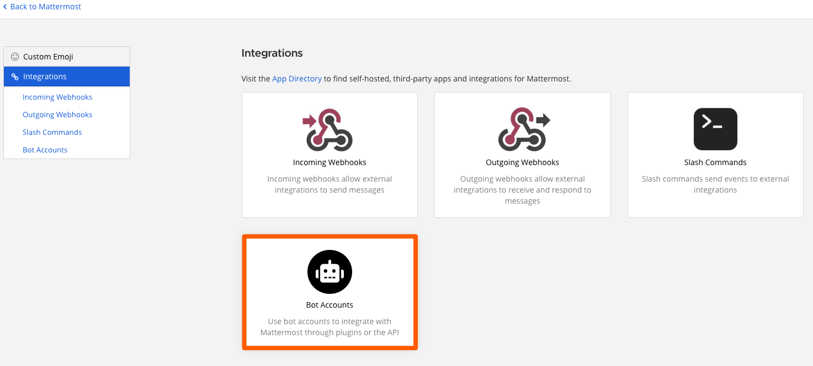
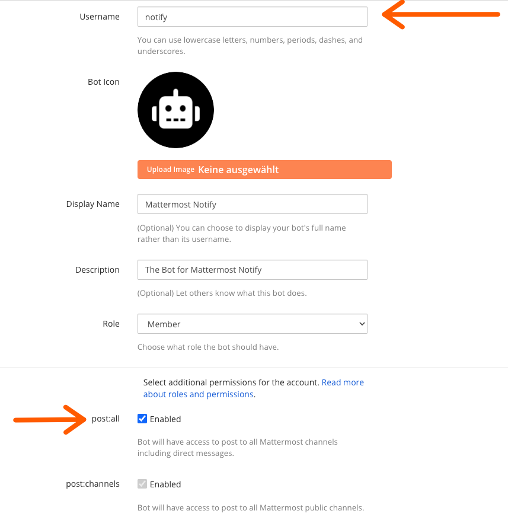
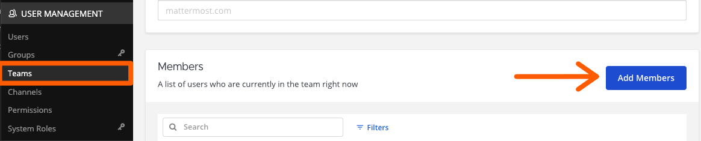

.. mattermost-notify documentation master file, created by
   sphinx-quickstart on Thu Jan 23 13:11:20 2025.
   You can adapt this file completely to your liking, but it should at least
   contain the root `toctree` directive.

Set up the Notify Bot
=====================

.. important::

   Make sure your Mattermost Server enables `Integrations`, `Bot Accounts`, and `Access Tokens`.
   Also make sure that your user account has the privileges to create a bot account. This documentation
   does **not** cover how to set up a Mattermost server! Please refer to the Mattermost documentation
   for more information.

1. Go to `Main Menu` -> `Integrations` -> `Bot Accounts`.

2. Click on `Add Bot Account` (upper right corner of the screen).
3. Fill in the `Username` and `Display Name` fields.

   - `Username`: `notify` (or any name you like!)
   - `Display Name`: `Notify Bot` (or any name you like)
   - `Description`: `Notify Bot for mattermost-notify` (or any description you like)
   - `Role`: `Member` (or any role you like, but no special privileges are needed)
   - At least `post:channels` is required but `post:all` is recommended to also allow direct messages.

4. Click on `Create Bot Account` (bottom right corner).
5. Copy the `Token` and save it in a safe place (you will need it later).

.. important::

   The `Token` is a secret key that allows the Mattermost-Notify client to sign into the Bot account.
   Since Mattermost-Notify is designed to work with one Bot account per server, this key should be accessible
   to all members of your team who need to use the Notify Bot.

   If you forget the token or have security concerns, you can always generate new tokens using the `Create New Token` button
   on the Bot Accounts page.

   .. image:: _static/screenshot_new_token.png
      :alt: New Token
      :align: center

Add the Bot to a Team
---------------------
The Notify Bot will need to be added to your team in order to send messages. To do this:

1. Go to `System Console` -> `User Management` -> `Teams` -> <select your team> -> `Add Members` -> <add the bot account>.
2. Add the Bot to any private channels that you want it to post in (public channels should work automatically).

   
.. note::

   If you do not see the `System Console` option (or an alternative setting that allows you to manage teams) 
   the your account likely is missing the right permissions. Please contact your Mattermost server administrator.

